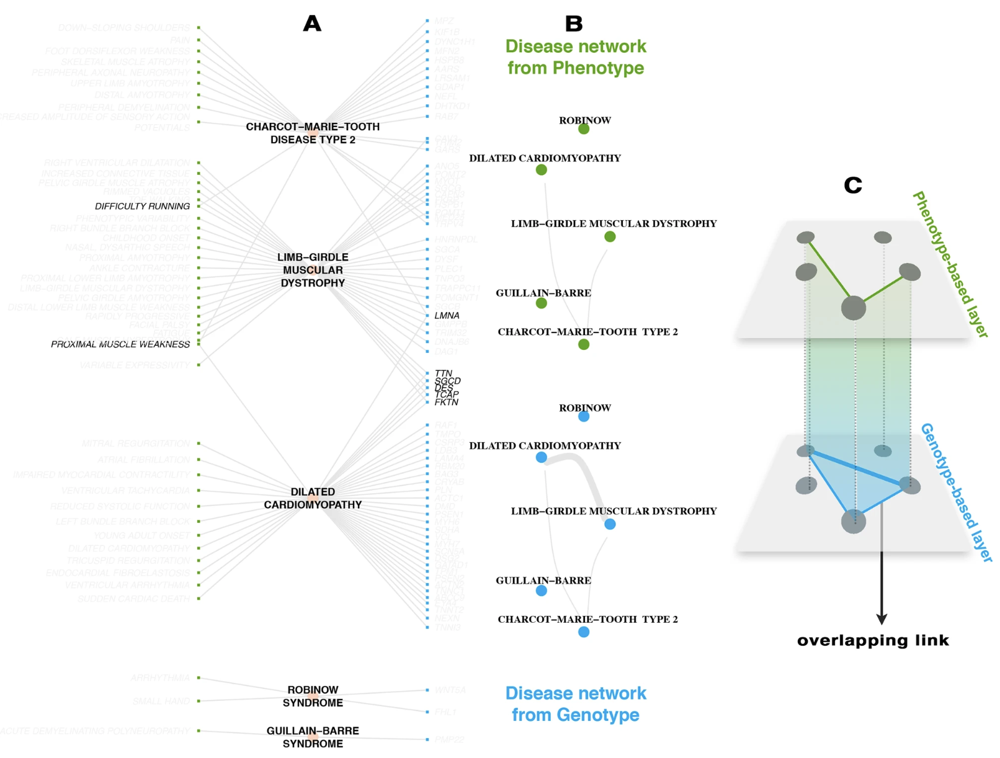

# The multiplex network of human diseases

### Precision medicine: multi-layered map of diseases enables new disease classification

The joint analysis of shared genes and symptoms on a multi-layered disease network – consisting of two layers representing gene and symptom relationships – uncovers an alternative grouping of diseases. 

On a global scale, diseases that shared genes also tended to share symptoms. An algorithm specifically designed to identify patterns in multi-layered networks determined groups of diseases that were highly similar to each other both genetically and symptomatically. 

This approach holds the potential to transcend today’s clinical observation-based disease classification systems. It may pave the way for a molecular-based disease classification, the discovery of novel disease relationships, and ultimately personalized diagnosis and treatment.

**Figure:** The multiplex disease network. **(A)** Tripartite network of symptoms (green nodes on the left), diseases (pink nodes in the middle) and genes (blue nodes on the right). Symptoms and genes that are shared between diseases are shown in darker text. **(B)** Phenotype- and genotype-based disease-disease networks where diseases are connected in the genotype layer (blue) if they share at least one gene and connected in the phenotype layer (green) if they share at least one symptom. The thickness of the edge is proportional to the number of common genes or symptoms. **(C)** The two networks are considered as layers of a multiplex system, where nodes are the diseases and colored links encode their interactions. Disease-disease interactions that are present in both layers are denoted “overlapping links.”

[Click here to read the peer-reviewed article online](https://www.nature.com/articles/s41540-019-0092-5)

## Description of the data sets

Two data sets are released, corresponding to network reconstruction based on [GWAS](https://www.ebi.ac.uk/gwas/) (*Genome-wide Association Study*) and [OMIM](https://www.omim.org/) (*Online Mendelian Inheritance in Man*) catalogs, respectively.

In both cases, the format is as follows: 

	disorder;disorder_OMIM;disorder_cat;symptom;symptom_cat;gene_symb;gene_OMIM;gene_cytoloc
	
where:

* `disorder`: Disorder name
* `disorder_OMIM`: OMIM identifier of the disorder
* `disorder_cat`: Disorder category
* `symptom`: Symptom name
* `symptom_cat`: Symptom category
* `gene_symb`: Gene symbol(s)
* `gene_OMIM`: OMIM identifier of the gene
* `gene_cytoloc`: Cytogenetic location

The above information is sufficient to build the bipartite networks representing Disease-Symptom interactions and Disease-Gene interactions. Each bipartite network can be easily projected on its Disease component, to create two Disease-Disease interaction networks, encoding Phenotype and Genotype information.

More specifically: 

* **R users**: with [igraph](https://www.rdocumentation.org/packages/igraph/) use the `bipartite_projection` function
* **Python users**: with [networkx](https://networkx.github.io/documentation/latest/index.html) use the `projected_graph` function

### Multiplex diseasome based on GWAS

File: `DSG_network_from_GWAS.csv`

### Multiplex diseasome based on OMIM

File: `DSG_network_from_OMIM.csv`

## Reference

If you use this data sets for your research, please cite the following article:

A. Halu, M. De Domenico, A. Arenas & A. Sharma, *The multiplex network of human diseases*, NPJ Systems Biology and Applications 5, 15 (2019)

[Click here to read the article online](https://www.nature.com/articles/s41540-019-0092-5)

## License

MultiplexDiseasome is made available under the Open Database License: [http://opendatacommons.org/licenses/odbl/1.0/](http://opendatacommons.org/licenses/odbl/1.0/). Any rights in individual contents of the database are licensed under the Database Contents License: [http://opendatacommons.org/licenses/dbcl/1.0/](http://opendatacommons.org/licenses/dbcl/1.0/)

**You are free:**

* *To Share*: To copy, distribute and use the database.
* *To Create*: To produce works from the database.
* *To Adapt*: To modify, transform and build upon the database.

As long as you:

**Attribute:** You must attribute any public use of the database, or works produced from the database, in the manner specified in the ODbL. For any use or redistribution of the database, or works produced from it, you must make clear to others the license of the database and keep intact any notices on the original database.  
**Share-Alike:** If you publicly use any adapted version of this database, or works produced from an adapted database, you must also offer that adapted database under the ODbL.  
**Keep open:** If you redistribute the database, or an adapted version of it, then you may use technological measures that restrict the work (such as DRM) as long as you also redistribute a version without such measures.

## Contacts

**Manlio De Domenico**  
Center for Information and Communication Technology  
Fondazione Bruno Kessler, Italy

**Email:** [mdedomenico@fbk.eu](mailto:mdedomenico@fbk.eu?subject=[GitHub]%20Multiplex%20Human%20Diseasome)  
**Web:** [https://comunelab.fbk.eu/](https://comunelab.fbk.eu/)
